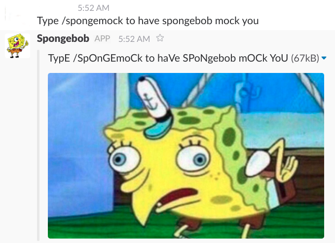

Spongemock
==========
Spongemock is a collection of services that add Spongebob mocking functionality
to a variety of platforms. Currently, only Slack and Twitter are supported.

Table of Contents
=================

   * [Spongemock](#spongemock)
   * [Setup](#setup)
   * [Slack Integration](#slack-integration)
      * [Example](#example)
      * [Slack Setup](#slack-setup)
   * [Twitter Integration](#twitter-integration)
      * [Example](#example-1)
      * [Bot Reply Rules](#bot-reply-rules)
      * [Twitter Setup](#twitter-setup)
   * [TODO](#todo)

Setup
=====
The Spongemock server can be hosted on Heroku by clicking the button below.

[](https://heroku.com/deploy)

Of course, you can always choose to host it somewhere else. You can run the app
with
```bash
go run cmd/spongemock/main.go&
go run cmd/worker/main.go&
```

Spongemock requires the following environmental variables to run:
- `PORT`: If your app is not being hosted on Heroku, you need to set this to be
  the port you want the server to be listening to.
- `APP_URL`: The URL the app is being hosted at.
- `PLUGINS`: A comma-separated list of the components of Spongemock you want to
  use. Leaving this variable blank means all components will be run.
- `DEBUG`: If this value is not set to `false`, no messages will be delivered
  to the platform and will be logged instead.

For setup instructions for the other components, refer to the Setup
instructions below:
* [Slack Setup](#slack-setup)
* [Twitter Setup](#twitter-setup)

Slack Integration
=================
The Spongemock Slack integration adds a slash command `/spongemock` which will
have Spongebob mock the last person who sent a message in the channel.

Example
-------


Slack Setup
-----------
First, create a Slack App and add a slash command. The request URL will be of
the form `$APP_URL/slack`. You also want to escape channels, users, and links
sent to your app.

To run the Slack plugin, the following environmental variables are required:
- `SLACK_CLIENT_ID`: This is your Slack Client ID.
- `SLACK_CLIENT_SECRET`: This is your Slack Client Secret.
- `SLACK_VERIFICATION_TOKEN`: This is your Slack verification token.

Setting the client ID and client secrets will allow the server to acquire OAuth
tokens from Slack so that it can read the messages to mock in channels and post
to those channels as well. The verification token is a secret string that Slack
will send to your server so the server knows that it is indeed Slack sending
requests and not some malicious third party.

Twitter Integration
===================
The spongemock Twitter bot has an official account at
https://twitter.com/spongemock_bot. This bot will respond to all mentions by
mocking the appropriate person's text. It does its best to strip out extraneous
text like beginning @'s and ending image links. Currently it does not check the
tweet length, and it may attempt to send tweets that are too long.

Example
-------
https://twitter.com/spongemock_bot/status/866809266790912002

Bot Reply Rules
---------------
If person A mentions the bot in a reply to person B, then the bot will mock
person A, unless person B is the bot itself, in which case it will mock person
A. Otherwise, if person A mentions the bot in a quote retweet of person B, the
bot will mock person B. If there is no person B, the bot will mock person A.

Twitter Setup
-------------
You need a Twitter account for the bot. Go to https://apps.twitter.com and
create a new app for your bot. Create an Access Token.

To run the Twitter bot, the following environmental variables are required:
- `TWITTER_USERNAME`: The handle for the Twitter account the bot will run on.
- `TWITTER_CONSUMER_KEY`: The consumer key (API key) listed in your Twitter
  application.
- `TWITTER_CONSUMER_SECRET`: The consumer secret (API secret) listed in your
  Twitter application.
- `TWITTER_ACCESS_TOKEN`: The access token listed in your Twitter application.
  You may need to delete a newline character to make this work.
- `TWITTER_ACCESS_TOKEN_SECRET`: The access token secret listed in your Twitter
  application.

If you are running the bot on a Heroku, you may need to run `heroku ps:scale
worker=1` since the Twitter bot runs on a worker dyno. Additionally, if you
have the web dyno running on a free tier, you may need to add the Heroku
Scheduler add-on and schedule the command `wakeup` every 30 minutes to prevent
the web and worker dynos from idling.

TODO
====
- [x] Add Slack support
- [x] Add Twitter Support
- [ ] Add Facebook Messenger Support
- [ ] Meme with the message inside the picture instead of as regular text on
  the side
- [ ] Add a website/API
- [ ] Add unit tests
